# GitHub Actions runners on AKS Automatic, step by step

Self-hosted GitHub Actions runners that scale from zero, on a Kubernetes cluster
that manages its own nodes. This repo runs the AKS team's blog post
[Running GitHub Actions Runner Controller on AKS Automatic](https://blog.aks.azure.com/2026/09/17/github-actions-runner-controller-aks-automatic)
(Steve Griffith, 17 September 2026) end to end, with one script per step and a
screenshot of what each step prints, so you can compare your output with mine.

No prior experience with Actions Runner Controller (ARC) or AKS Automatic is needed.

## Quick start

```bash
gh repo fork sathpal/arc-aks-automatic-demo --clone && cd arc-aks-automatic-demo
make tools                          # installs or upgrades the CLIs
cp .env.example .env                # set GITHUB_OWNER to your GitHub user
make check                          # tools, logins, .env: fix anything marked ✗
make quota                          # request the vCPU quota AKS Automatic needs
make cluster                        # 20 to 35 minutes
make access && make arc             # RBAC + kubelogin, then the controller
export GITHUB_TOKEN=$(gh auth token)
make runners && make test           # runner scale set, then a workflow run you can watch
make cleanup                        # delete everything
```

Each step is explained below with the output you should see.

## What you will end up with

| | |
|---|---|
| cluster | AKS Automatic: node auto-provisioning (Karpenter), Azure RBAC, Deployment Safeguards, managed monitoring |
| controller | Actions Runner Controller in `arc-systems` |
| runner set | `arc-auto-runners`, min 0, max 3, registered to your fork of this repo |
| proof | a workflow that runs on `runs-on: arc-auto-runners`, scales a runner pod and a node from zero, finishes, and scales back to zero |
| time | about 45 minutes, of which 30 is waiting for the cluster |
| cost | roughly one US dollar per hour while the cluster exists; the last step deletes it |

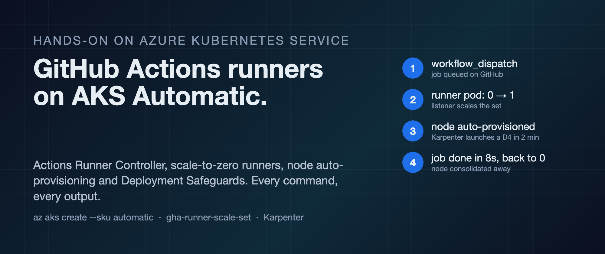

## Before you start

- **A Mac or Linux machine with Homebrew.** `make tools` installs the CLIs.
- **An Azure subscription** where you can create resource groups and request quota. Log in with `az login`.
- **A GitHub account and a fork of this repo.** The runners register against a repository, and the validation workflow has to exist in that repository. Fork this repo, then clone your fork. If you would rather use an existing repo of yours, copy `.github/workflows/arc-automatic-validation.yml` into it and set `GITHUB_REPO` in `.env`.
- **A GitHub token.** For this lab, the token the GitHub CLI already holds is enough: `export GITHUB_TOKEN=$(gh auth token)`. It needs the `repo` scope. For anything shared, use a GitHub App instead.

```bash
gh repo fork sathpal/arc-aks-automatic-demo --clone && cd arc-aks-automatic-demo
make tools                      # azure-cli (upgraded), kubectl, helm, gh, kubelogin, az quota extension
cp .env.example .env            # then set GITHUB_OWNER to your GitHub user, and LOCATION if you want
make check                      # verifies all of the above before you spend any money
```

Do **not** install the `aks-preview` Azure CLI extension. The `--sku automatic` flag is in the core CLI (2.80 and newer), and the preview extension broke every `az aks` command on the CLI version I started with.

## Step 1. Quota

AKS Automatic refuses to create a cluster unless one VM family from its list has at least 16 vCPUs of quota in your region. A fresh subscription has 10 in every family. Check, and request more, in one go:

```bash
make quota
```

The request went through instantly for the `standardDaldv6Family` (the AMD v6 sizes) in Australia East. The same request for the DSv5 family was refused with "ContactSupport". If yours is refused, change `QUOTA_FAMILY` in `.env` to another family from the list in Troubleshooting and try again.

## Step 2. Create the cluster

```bash
make cluster                    # 20 to 35 minutes
```

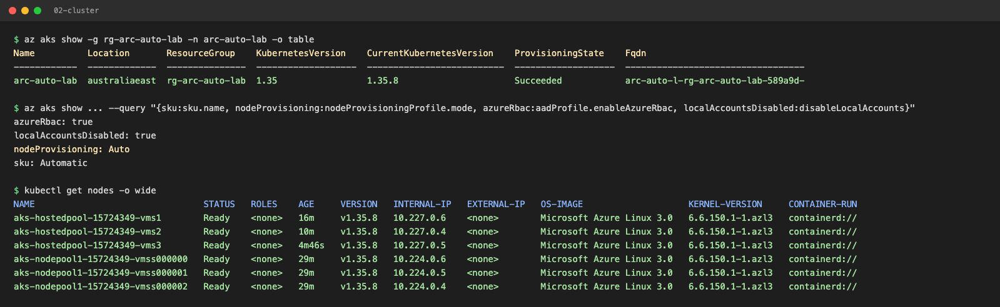

Mine took 33 minutes. When it finishes you have six nodes already: three system nodes and three "hosted pool" nodes that AKS uses for its own add-ons. All on Azure Linux.

## Step 3. Get access

AKS Automatic disables local Kubernetes accounts. You grant yourself a Kubernetes role through Azure RBAC and authenticate with kubelogin:

```bash
make access
```

It assigns "Azure Kubernetes Service RBAC Cluster Admin" to the signed-in user, fetches credentials in exec format, waits for the role to propagate, and prints the nodes.

## Step 4. Install the controller

```bash
make arc
```

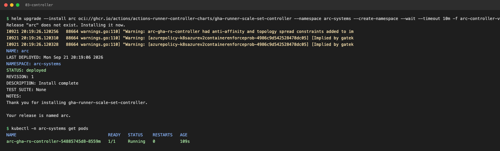

The chart's default has no resource requests, and Deployment Safeguards deny pods without them. [k8s/arc-controller-values.yaml](k8s/arc-controller-values.yaml) adds them. Safeguards still print warnings, which the script shows you:

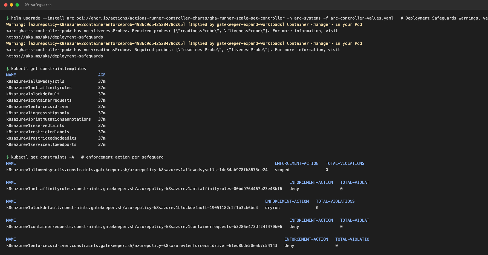

Those are warn-level, so the install goes through. Only the policies with enforcement action `deny` can stop you.

## Step 5. Install the runner scale set

```bash
export GITHUB_TOKEN=$(gh auth token)
make runners
```

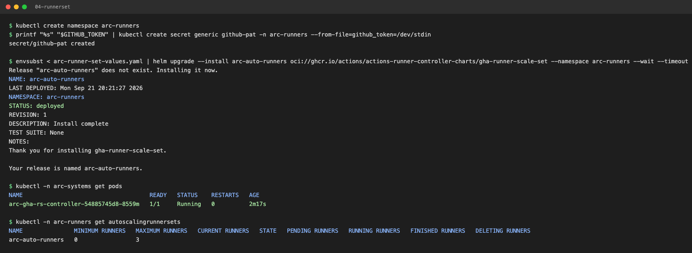

[k8s/arc-runner-set-values.yaml](k8s/arc-runner-set-values.yaml) sets three things Safeguards insist on: resource requests on the listener, resource requests on the runner, and a pinned runner image tag instead of `latest`. It also sets `minRunners: 0`.

A listener pod appears in `arc-systems`. It holds a long-poll session with GitHub and creates runner pods only when a job is queued. Until then the repository's runner list is empty, which looks wrong and is not.

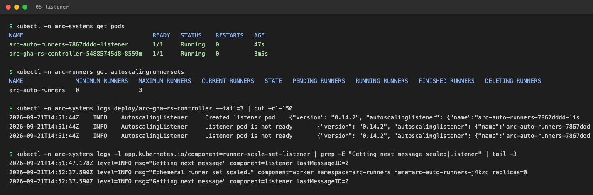

## Step 6. Run a workflow and watch it scale

```bash
make test
```

This triggers [.github/workflows/arc-automatic-validation.yml](.github/workflows/arc-automatic-validation.yml) in your fork and prints, every ten seconds, the run status, the runner pods and the node count:

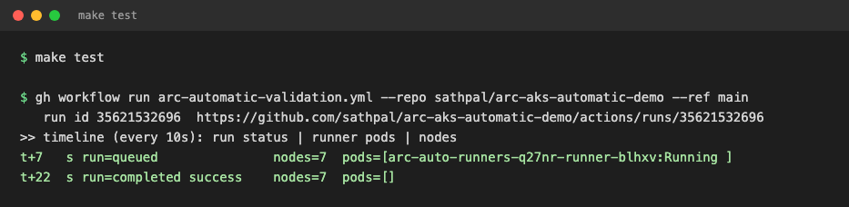

That is a warm run: 22 seconds from dispatch to success, because a node Karpenter had created earlier was still there. The very first job on a fresh cluster is the cold case and looks different. Mine went:

1. **t+19s** the listener saw the queued job and created one runner pod. It stayed Pending: the system nodes are tainted and nothing else had 2 CPUs and 4 GiB free.
2. **t+53s** node auto-provisioning launched a node for it. The pod was nominated onto the node claim before the VM existed.
3. **t+121s** the node joined and the pod pulled the runner image, about a gigabyte, in 52 seconds.
4. **t+173s** the job ran. It took 8 seconds.
5. **t+190s** the run reported success, the pod was gone, and the runner count was back to zero.

Run `make test` twice on a fresh cluster and you will see both.

The script then prints the run summary, the trimmed job log, and what Karpenter did:

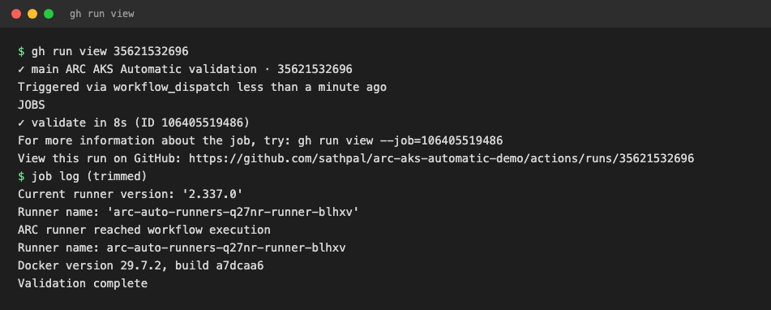

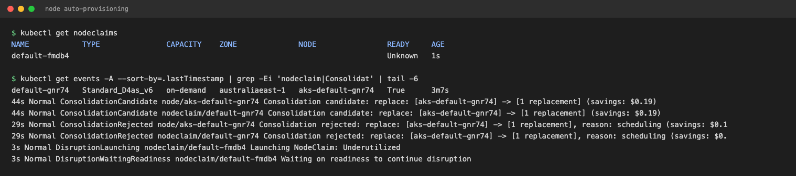

On GitHub it looks like any other run:

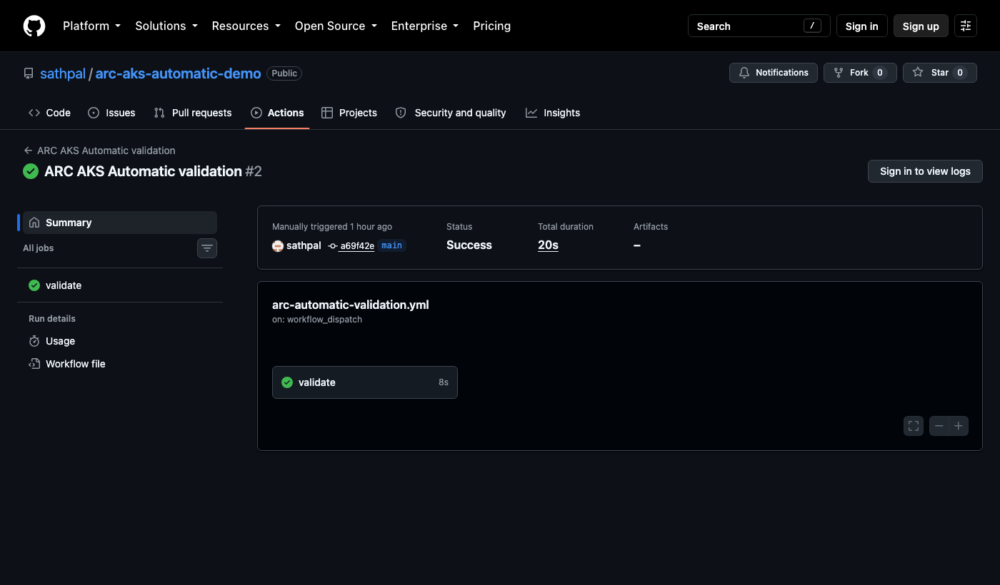

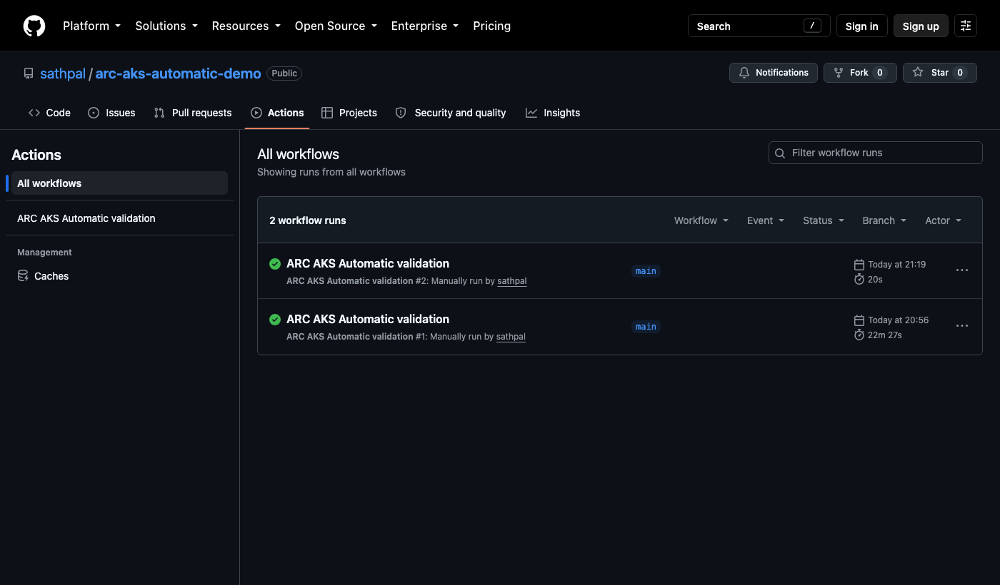

## Step 7. Look around, then delete everything

```bash
make status                     # nodes, node claims, ARC pods, runner set
make cleanup                    # uninstalls ARC, deletes the resource group in the background
```

## Observations

- **The blog is accurate.** Its values files are exactly what Safeguards requires. The steps here are the blog's steps with a script around each.
- **The two blockers were outside the blog.** Quota (16 vCPUs in one accepted family; defaults are 10) and CLI version. Both cost me more time than everything else combined, so the repo checks for them first.
- **Cluster creation is slow.** 33 minutes. Automatic builds a lot: zone-spread system pool, hosted add-on pool, Karpenter, Prometheus, Grafana, policy stack.
- **Cold start is the whole latency.** 2 minutes 48 seconds from dispatch to success, of which 8 seconds was the job. A new VM and a cold image pull are the rest. A second job while the node is warm starts in seconds. `minRunners: 1` removes the cold start at the price of one idle D4.
- **Karpenter does more than scale up.** After the job it flagged the D4as_v6 it had created as underused, launched a cheaper D4als_v6, moved the pods and deleted the original, with the saving printed in the event. Nothing was configured for that.
- **The cluster does not return to zero Karpenter nodes.** The controller and listener pods cannot run on the tainted system nodes, so once Karpenter has a node they live there, and that node stays. The upside is that later runner pods land on it and start in seconds; the downside is one D4 billing around the clock. Decide whether you want that; a node selector or toleration for the system pool changes it.
- **Safeguards are mostly advice.** Of the constraints on the cluster, a handful deny; most warn or dry-run. Read the warnings anyway: missing probes on the controller is a real finding.
- **Changing the repository URL in place does not work.** I re-pointed the runner set at a different repo with `helm upgrade` and the listener crashed with "No runner scale set found with identifier 1": the set kept the ID it had registered under the old repo. Uninstall and reinstall instead, and if the listener still errors, delete the stale `AutoscalingListener` object and let the controller recreate it. That is in Troubleshooting.
- **The runner version matters.** The blog pins 2.336.0; 2.337.0 was current a few days later. GitHub refuses runners that fall too far behind, so check the releases page before copying a tag.

## Pros

- **Zero idle cost for runners.** Nothing runs between jobs, not even a node, and you still get a runner two to three minutes after a job is queued.
- **No node pools to size.** Karpenter picks a VM that fits the runner's request, and consolidates afterwards.
- **Guardrails you did not have to write.** Safeguards caught missing requests, missing probes and a floating tag on upstream charts.
- **Sane defaults for identity.** Azure RBAC for Kubernetes, no local accounts, kubelogin. The cluster is secured the way a reviewer would ask for.
- **Runners are ephemeral.** One pod per job, deleted afterwards. No state leaks between builds.

## Cons

- **Cold start latency.** Two to three minutes per cold job is fine for CI, painful for anything interactive. Pay for a warm runner if that matters.
- **Cluster creation time and cost.** Half an hour to create, and the six baseline nodes bill whether or not a job ever runs. This is a platform for a team, not a single repo.
- **Quota work up front.** Default subscriptions cannot create an Automatic cluster. Expect a quota round trip, and possibly a support ticket for some families.
- **Less control.** You cannot pick the system node size, and some Safeguards policies are deny-mode with no opt-out short of changing the safeguards level.
- **Docker inside the runner is not what the log suggests.** `docker --version` prints a version because the client is in the image. The pod spec has no daemon and no socket, so `docker build` will not work. Container builds need a different pattern (Kaniko, BuildKit, or a DinD sidecar that Safeguards will have opinions about).
- **PAT in a Secret.** Fine for a lab, wrong for a team. Use a GitHub App.

## Troubleshooting

**`az aks create` fails with "could not find a suitable VM size ... required quota of '16' vCPUs".**
The message lists the sizes it accepts. The quota family for each size, from `az vm list-skus -l <region> --size Standard_D4 --query "[].[name,family]" -o table`, was in my region:

| size | quota family |
|---|---|
| Standard_D4alds_v6 | standardDaldv6Family |
| Standard_D4lds_v6 | StandardDldsv6Family |
| Standard_D4ads_v5 | standardDADSv5Family |
| Standard_D4ds_v5 | standardDDSv5Family |
| Standard_D4lds_v5 | standardDLDSv5Family |
| Standard_D4d_v5 | standardDDv5Family |
| Standard_D4d_v4 | standardDDv4Family |

Set `QUOTA_FAMILY` in `.env` and run `make quota`. The v6 AMD family was approved instantly for me; DSv5 was refused.

**Every `az aks` command dies with a Python traceback after adding aks-preview.**
The extension is newer than your CLI. `az extension remove -n aks-preview` and `brew upgrade azure-cli`.

**`kubectl` says forbidden right after `make access`.**
Role assignment takes a minute or two to propagate. The script waits up to five minutes; just re-run `make access`.

**Listener pod in Error with "No runner scale set found with identifier N".**
You changed `githubConfigUrl` on an installed release. `helm uninstall arc-auto-runners -n arc-runners`, wait until `kubectl -n arc-runners get autoscalingrunnersets` is empty, then `make runners`.

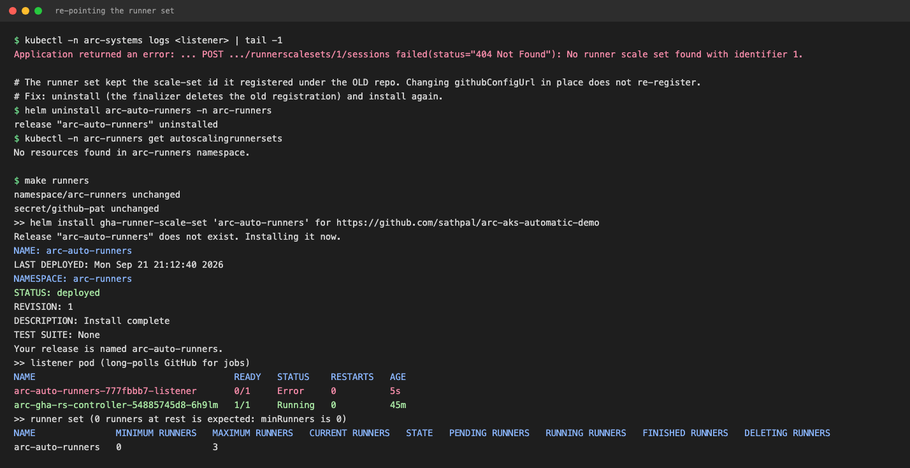

**Listener pod in Error with "could not patch ephemeral runner set ... not found".**
A stale listener object from a previous install. `kubectl -n arc-systems delete autoscalinglistener --all`; the controller recreates it within seconds against the current runner set.

**Runner pod Pending for more than three minutes.**
`kubectl -n arc-runners describe pod <name>` and look at Events. "Insufficient memory" plus "untolerated taint" is normal for the first minute while Karpenter launches a node. Anything mentioning quota means the runner's node family is capped; the nodeclaim's events (`kubectl get nodeclaims`, `kubectl describe nodeclaim <name>`) will say which.

**Workflow queued forever.**
Check that `runs-on` in the workflow equals `RUNNER_SET_NAME` in `.env`, that the workflow is on the branch in `GITHUB_BRANCH`, and that the listener pod is Running.

## What is in the repo

```
.env.example          every name and setting; copy to .env
Makefile              one target per step; each just runs a script
scripts/              check, 00-tools, 01-quota, 02-cluster, 03-access, 04-arc, 05-runners, 06-test, 07-status, 99-cleanup
k8s/                  arc-controller-values.yaml, arc-runner-set-values.yaml
.github/workflows/    arc-automatic-validation.yml, the job that proves it works
docs/img/             the screenshots in this README
out/                  logs and the timeline from your own run (not committed)
```
